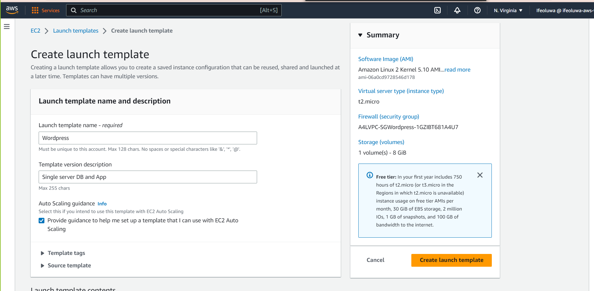

#STAGE 1A - LOGIN TO AN AWS ACCOUNT
> Log into AWS account using a user with admin privileges

> Using Cloud Formation create a stack

>Launch an EC2 instance to run wordpress

### STAGE 1B - CREATE SSM PARAMETER STORE VALUES FOR WORDPRESS

    Create Parameter - DBUser (the login for the specific wordpress DB)

    Create Parameter - DBName (the name of the wordpress database)

    Create Parameter - DBEndpoint (the endpoint for the wordpress DB .. )

    Create Parameter - DBPassword (the password for the DBUser)

    Create Parameter - DBRootPassword (the password for the database root user, used for self-managed admin)

### STAGE 1C - CONNECT TO THE INSTANCE AND INSTALL A DATABASE AND WORDPRESS

> Connect into the instance using session manager

> Cd into the root account

    sudo bash
    cd
    clear

> Bring the parameter store values into ENV variables to make the manual build easier

    DBPassword=$(aws ssm get-parameters --region us-east-1 --names /A4L/Wordpress/DBPassword --with-decryption --query Parameters[0].Value)
    DBPassword=`echo $DBPassword | sed -e 's/^"//' -e 's/"$//'`

    DBRootPassword=$(aws ssm get-parameters --region us-east-1 --names /A4L/Wordpress/DBRootPassword --with-decryption --query Parameters[0].Value)
    DBRootPassword=`echo $DBRootPassword | sed -e 's/^"//' -e 's/"$//'`

    DBUser=$(aws ssm get-parameters --region us-east-1 --names /A4L/Wordpress/DBUser --query Parameters[0].Value)
    DBUser=`echo $DBUser | sed -e 's/^"//' -e 's/"$//'`

    DBName=$(aws ssm get-parameters --region us-east-1 --names /A4L/Wordpress/DBName --query Parameters[0].Value)
    DBName=`echo $DBName | sed -e 's/^"//' -e 's/"$//'`

    DBEndpoint=$(aws ssm get-parameters --region us-east-1 --names /A4L/Wordpress/DBEndpoint --query Parameters[0].Value)
    DBEndpoint=`echo $DBEndpoint | sed -e 's/^"//' -e 's/"$//'`

> Install updates

    sudo yum -y update
    sudo yum -y upgrade

> Install Pre-Reqs and Web Server

    sudo yum install -y mariadb-server httpd wget
    sudo amazon-linux-extras install -y lamp-mariadb10.2-php7.2 php7.2
    sudo amazon-linux-extras install epel -y
    sudo yum install stress -y

> Set DB and HTTP Server to running and start by default

    sudo systemctl enable httpd
    sudo systemctl enable mariadb
    sudo systemctl start httpd
    sudo systemctl start mariadb

> Set the MariaDB Root Password

    sudo mysqladmin -u root password $DBRootPassword

> Download and Extract Wordpress

    sudo wget http://wordpress.org/latest.tar.gz -P /var/www/html
    cd /var/www/html
    sudo tar -zxvf latest.tar.gz
    sudo cp -rvf wordpress/* sudo rm -R wordpress
    sudo rm latest.tar.gz 

> Configure the wordpress wp-config.php file

    sudo cp ./wp-config-sample.php ./wp-config.php
    sudo sed -i "s/'database_name_here'/'$DBName'/g" wp-config.php
    sudo sed -i "s/'username_here'/'$DBUser'/g" wp-config.php
    sudo sed -i "s/'password_here'/'$DBPassword'/g" wp-config.php

> Fix Permissions on the filesystem

    sudo usermod -a -G apache ec2-user   
    sudo chown -R ec2-user:apache /var/www
    sudo chmod 2775 /var/www
    sudo find /var/www -type d -exec chmod 2775 {} \;
    sudo find /var/www -type
    f -exec chmod 0664 {} \;

> Create Wordpress User, set its password, create the database and configure permissions

    sudo echo "CREATE DATABASE $DBName;" >> /tmp/db.setup
    sudo echo "CREATE USER '$DBUser'@'localhost' IDENTIFIED BY '$DBPassword';" >> /tmp/db.setup
    sudo echo "GRANT ALL ON $DBName.* TO '$DBUser'@'localhost';" >> /tmp/db.setup
    sudo echo "FLUSH PRIVILEGES;" >> /tmp/db.setup
    sudo mysql -u root --password=$DBRootPassword < /tmp/db.setup
    sudo rm /tmp/db.setup

> Test Wordpress is installed

    connect to the instance by copying and pasting IPV4 public address

> Perform Initial Configuration and make a post

### STAGE 2A - CREATE THE LAUNCH TEMPLATE

> Go to EC2 console and create a lunch template

### STAGE 2B - ADD USERDATA

    #!/bin/bash -xe

    DBPassword=$(aws ssm get-parameters --region us-east-1 --names /A4L/Wordpress/DBPassword --with-decryption --query Parameters[0].Value)
    DBPassword=`echo $DBPassword | sed -e 's/^"//' -e 's/"$//'`

    DBRootPassword=$(aws ssm get-parameters --region us-east-1 --names /A4L/Wordpress/DBRootPassword --with-decryption --query Parameters[0].Value)
    DBRootPassword=`echo $DBRootPassword | sed -e 's/^"//' -e 's/"$//'`

    DBUser=$(aws ssm get-parameters --region us-east-1 --names /A4L/Wordpress/DBUser --query Parameters[0].Value)
    DBUser=`echo $DBUser | sed -e 's/^"//' -e 's/"$//'`

    DBName=$(aws ssm get-parameters --region us-east-1 --names /A4L/Wordpress/DBName --query Parameters[0].Value)
    DBName=`echo $DBName | sed -e 's/^"//' -e 's/"$//'`

    DBEndpoint=$(aws ssm get-parameters --region us-east-1 --names /A4L/Wordpress/DBEndpoint --query Parameters[0].Value)
    DBEndpoint=`echo $DBEndpoint | sed -e 's/^"//' -e 's/"$//'`

    yum -y update
    yum -y upgrade

    yum install -y mariadb-server httpd wget
    amazon-linux-extras install -y lamp-mariadb10.2-php7.2 php7.2
    amazon-linux-extras install epel -y
    yum install stress -y

    systemctl enable httpd
    systemctl enable mariadb
    systemctl start httpd
    systemctl start mariadb

    mysqladmin -u root password $DBRootPassword

    wget http://wordpress.org/latest.tar.gz -P /var/www/html
    cd /var/www/html
    tar -zxvf latest.tar.gz
    cp -rvf wordpress/* .
    rm -R wordpress
    rm latest.tar.gz

    sudo cp ./wp-config-sample.php ./wp-config.php
    sed -i "s/'database_name_here'/'$DBName'/g" wp-config.php
    sed -i "s/'username_here'/'$DBUser'/g" wp-config.php
    sed -i "s/'password_here'/'$DBPassword'/g" wp-config.php
    sed -i "s/'localhost'/'$DBEndpoint'/g" wp-config.php

    usermod -a -G apache ec2-user   
    chown -R ec2-user:apache /var/www
    chmod 2775 /var/www
    find /var/www -type d -exec chmod 2775 {} \;
    find /var/www -type f -exec chmod 0664 {} \;

    echo "CREATE DATABASE $DBName;" >> /tmp/db.setup
    echo "CREATE USER '$DBUser'@'localhost' IDENTIFIED BY '$DBPassword';" >> /tmp/db.setup
    echo "GRANT ALL ON $DBName.* TO '$DBUser'@'localhost';" >> /tmp/db.setup
    echo "FLUSH PRIVILEGES;" >> /tmp/db.setup
    mysql -u root --password=$DBRootPassword < /tmp/db.setup
    rm /tmp/db.setup

### STAGE 2C - LAUNCH AN INSTANCE USING LAUCH TEMPLATES
> Select launch templates and launch an instance from it 

> Setup instance config

### STAGE 2D - TEST
> Log into the instance wordpress using http

> Perform initial configuration and make a post

### STAGE 3 - CREATE RDS SUBNET GROUP

### STAGE 3C - MIGRATE WORDPRESS DATA FROM MARIADB TO RDS

### STAGE 3D -STOP THE MARIADB SERVICE

### STAGE 3E - TEST WORDPRESS

### STAGE 3F - UPDATE THE LT 
> Modify (Create new Version) of launch templates

> Most of the configurations remain the same asides 

    Template version description should be Single Server App only
    
    Advanced details -User Data:
    Locate and remove the following lines:

    systemctl enable mariadb
    systemctl start mariadb
    mysqladmin -u root password $DBRootPassword

    echo "CREATE DATABASE $DBName;" >> /tmp/db.setup
    echo "CREATE USER '$DBUser'@'localhost' IDENTIFIED BY '$DBPassword';" >> /tmp/db.setup
    echo "GRANT ALL ON $DBName.* TO '$DBUser'@'localhost';" >> /tmp/db.setup
    echo "FLUSH PRIVILEGES;" >> /tmp/db.setup
    mysql -u root --password=$DBRootPassword < /tmp/db.setup
    rm /tmp/db.setup

> Set the the template as a default version

### STAGE 4 CREATE EFS FILE SYSTEM 
> Move to Elastic file system console and create a file system

### STAGE 4B - ADD AN FSID TO PARAMETER STORE

> Create a parametere store value for the file system using the file system ID has value

### STAGE 4C - CONNECT THE FILE SYSTEM TO THE EC2 INSTANCE AND COPY DATA

> Connect to the instance using system manager

    sudo yum -y install amazon-efs-utils
> Migrate the existing media content from wp-content into EFS

    cd /var/www/html
    sudo mv wp-content/ /tmp
    sudo mkdir wp-content

> Get the EFS file system ID from the parameter store

    EFSFSID=$(aws ssm get-parameters --region us-east-1 --names /A4L/Wordpress/EFSFSID --query "Parameters[0].Value" --output text)
    
    EFSFSID=$(echo "$EFSFSID" | sed 's|https://us-east-1.console.aws.amazon.com/efs/home?region=us-east-1#/file-systems/||; s|:$||')

> Add a line to /etc/fstab to configure the EFS file system to mount as /var/www/html/wp-content

    echo -e "$EFSFSID:/ /var/www/html/wp-content efs _netdev,tls,iam 0 0" >> /etc/fstab

    mount -a -t efs defaults
 

 > Copy the origin content data back in and fix permissions

    mv /tmp/wp-content/* /var/www/html/wp-content/

    chown -R ec2-user:apache /var/www/

### STAGE 4D - TEST THAT THE WORDPRESS APP CAN LOAD THE MEDIA
    reboot

### STAGE 4E- UPDATE THE LAUNCH TEMPLATE WITH THE CONFIG TO AUTOMATE THE EFS PART

> ON EC2 Console click on Launch Templates and modify the template userdata

    EFSFSID=$(aws ssm get-parameters --region us-east-1 --names /A4L/Wordpress/EFSFSID --query Parameters[0].Value)

    EFSFSID=`echo $EFSFSID | sed -e 's/^"//' -e 's/"$//'`
    
    mkdir -p /var/www/html/wp-content

    chown -R ec2-user:apache /var/www/
    
    echo -e "$EFSFSID:/ /var/www/html/wp-content efs _netdev,tls,iam 0 0" >> /etc/fstab

    mount -a -t efs defaults

> Set default version

### STAGE 5A - CREATE THE LOAD BALANCER

> On EC2 console click on load balancer and create a load balancer

> While the load balancer is creating, Copy and keep DNS name

### STAGE 5B - CREATE A NEW PARAMETER STORE VALUE WITH THE ELB DNS NAME

### STAGE 5C - UPDATE THE LAUNCH TEMPLATE TO WORDPRESS IS UPDATED WITH THE ELB DNS AS ITS HOME 

> Update the userdata

    ALBDNSNAME=$(aws ssm get-parameters --region us-east-1 --names /A4L/Wordpress/ALBDNSNAME --query Parameters[0].Value)

    ALBDNSNAME=`echo $ALBDNSNAME | sed -e 's/^"//' -e 's/"$//'`

    cat >> /home/ec2-user/update_wp_ip.sh<< 'EOF'
    #!/bin/bash
    source <(php -r 'require("/var/www/html/wp-config.php"); echo("DB_NAME=".DB_NAME."; DB_USER=".DB_USER."; DB_PASSWORD=".DB_PASSWORD."; DB_HOST=".DB_HOST); ')
    SQL_COMMAND="mysql -u $DB_USER -h $DB_HOST -p$DB_PASSWORD $DB_NAME -e"
    OLD_URL=$(mysql -u $DB_USER -h $DB_HOST -p$DB_PASSWORD $DB_NAME -e 'select option_value from wp_options where option_id = 1;' | grep http)

    ALBDNSNAME=$(aws ssm get-parameters --region us-east-1 --names /A4L/Wordpress/ALBDNSNAME --query Parameters[0].Value)
    ALBDNSNAME=`echo $ALBDNSNAME | sed -e 's/^"//' -e 's/"$//'`

    $SQL_COMMAND "UPDATE wp_options SET option_value = replace(option_value, '$OLD_URL', 'http://$ALBDNSNAME') WHERE option_name = 'home' OR option_name = 'siteurl';"
    $SQL_COMMAND "UPDATE wp_posts SET guid = replace(guid, '$OLD_URL','http://$ALBDNSNAME');"
    $SQL_COMMAND "UPDATE wp_posts SET post_content = replace(post_content, '$OLD_URL', 'http://$ALBDNSNAME');"
    $SQL_COMMAND "UPDATE wp_postmeta SET meta_value = replace(meta_value,'$OLD_URL','http://$ALBDNSNAME');"
    EOF

    chmod 755 /home/ec2-user/update_wp_ip.sh
    echo "/home/ec2-user/update_wp_ip.sh" >> /etc/rc.local
    /home/ec2-user/update_wp_ip.sh

> Set the launch template as default version 4

### STAGE 5D - CREATE AN AUTO SCALING GROUP

> Prove the ASG would start a new instance automatically when CPU utilization is high

> Connect to instance using session manager

    stress -c 2 -v -t 3000

    

### STAGE 6 - CLEAN UP

> Clean up account and remove all resources created during this project

.png)

